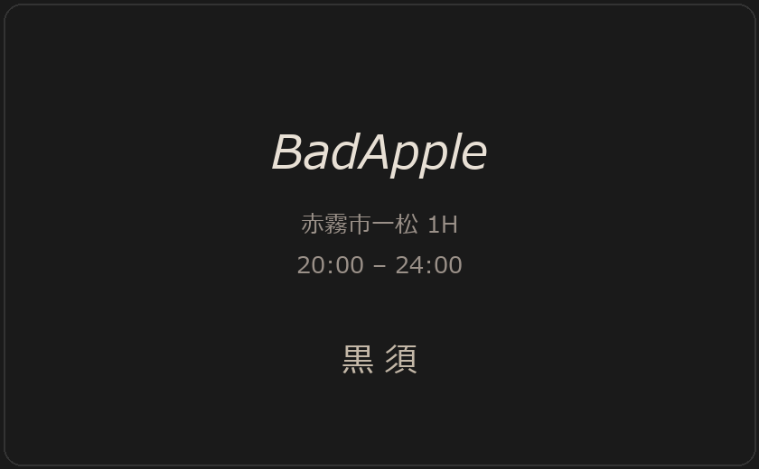
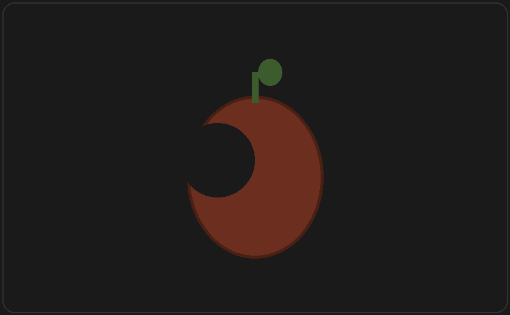

# 黒須の名刺

**【プレイヤー向けハンドアウト】**

BadApple のマスターが、スマートフォンを届けた礼として渡してくれた名刺です。

---

## 表面

- 厚手の黒いカード。角は少し丸みがある
- 字体はシンプル。バー名だけがやや大きい
- 電話番号やメールは**記載されていない**

---

## 裏面

中央に、**かじられたリンゴのマーク**が押されている。

- インクは暗い赤茶色
- マスターのスマートウォッチ、土井のスマホ背面のステッカーと**同じマーク**

---

## 渡されたときの言葉（参考）

> 「この名刺を持って行ってくれ。**かじられたリンゴのマーク**の付いた端末を持った人間に合ったら、これを見せて私の紹介だと言えば、情報収集に協力してくれるだろう。」

---

## 使い方（探索者が理解できる範囲）

- 同じ**かじられたリンゴのマーク**を知っている者への**紹介状**のように扱える
- 名刺を見せれば、聞き込みや情報交換がスムーズになる**かもしれない**（相手次第）

---

**KP注**: 画像は `CoC/assets/その他/01_賢者の石/PL/`。詳細運用は `KP_人物_黒須.md` を参照。